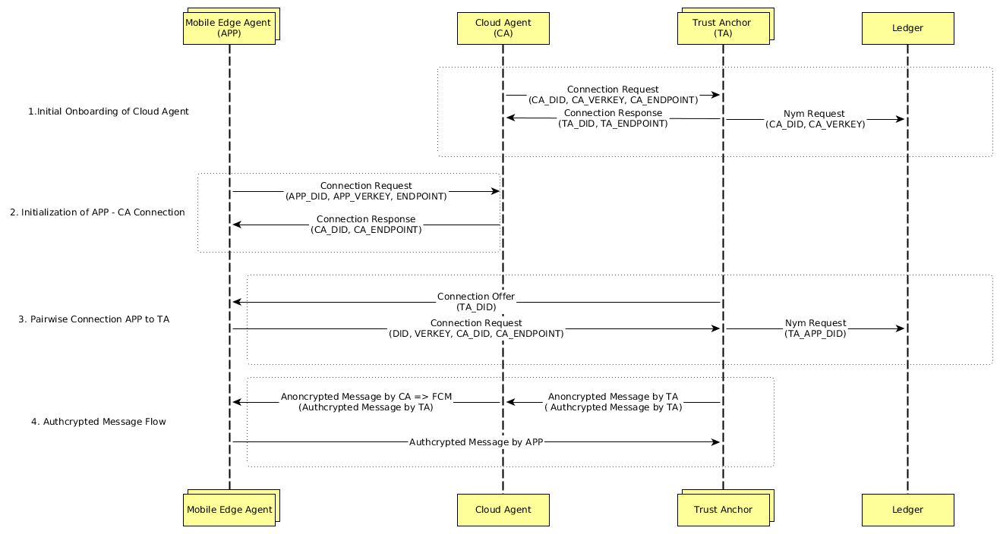

# Cloud Agent Message Flow

This documentation illustrates the steps required to use the Cloud Agent API with Mobile Edge Agents. 

## Functionality 

* Provides unique endpoints to be used within Hyperledger Indy for mobile clients
* Uses Firebase Cloud Messaging (FCM) to communicate with mobile devices supporting FCM

## Sequence Flow

1. The Cloud Agent (CA) requires an initial onboarding from a Trust Anchor (TA) in order to be known on the Ledger. Therefore it sends a connection request to the TA, which should be acknowledged by a connection response. The TA will onboard the CA with a nym request to the ledger.

2. The Mobile Edge Agent (APP) sends a connection request to a known CA containing the did, verification key and the endpoint in form of a Firebase Token. The CA replies a connection response containing the CA's did and endpoint which can be used by the APP for further communication.

3. The APP follows the pairwise connection pattern with responding to TAs connections offers with a connection request and provides the CA's did and endpoint to be reached by the TA alongside it's own did and verification key. 

4. The TA sends authcrypted payload messages regarding the APP to the provided CA endpoint anoncrypted with the key of the CA. The CA decrypts the anoncrypted message with it's private key and forwards the payload message anoncrypted to the APP through the provided Firebase Token with FCM. The APP can directly respond to the TA's endpoint with other authcrypted message.

Notes: 
 - It is assumed that the TA has been previously onboarded and has Trust Anchor priviledges to write on the ledger.
 - FCM limits the message payload to 4KB. Messages with payloads >=4KB will be temporarily stored on the CA. The CA provides a unique URL to retrieve the message payload.
 - Follow the Swagger documentation for specific formats on exchanged messages and formats.
 
 
 Monday, 20. August 2018 03:49pm 
